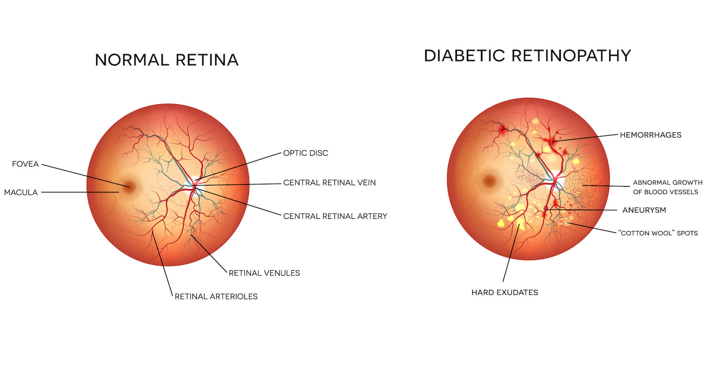
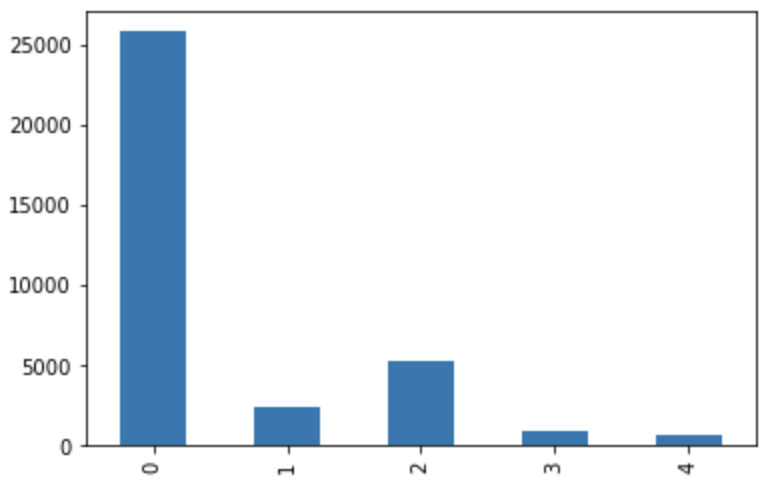
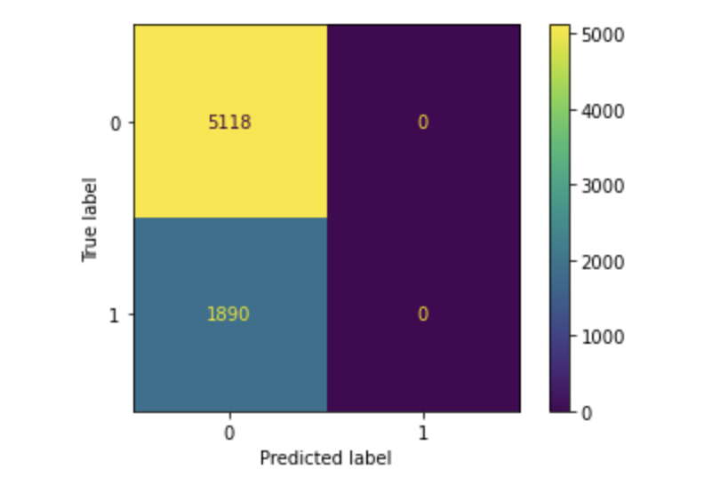
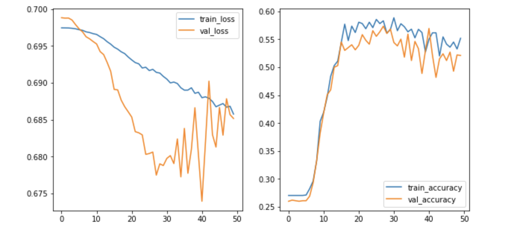

# Classifying Diabetic Retinopathy with CNN

In this project I use AI to detect the presence of Diabetic Retinopathy in thousands of retinal images provided by eyePACS using a Convolutional Neural Network (CNN). In the end my model had a 73% accuracy score. 

## Introduction
Diabetic Retinopathy (DR) is a condition that causes vision loss and blindness for people who have diabetes. The longer you have diabetes the more likely you will develop DR. This condition is significant because it’s the leading cause of blindness in adults affecting over 103 million people worldwide according to the [National Library of Medicine](https://pubmed.ncbi.nlm.nih.gov/33940045/#:~:text=In%202020%2C%20the%20number%20of,%2C%20and%2028.61%20million%2C%20respectively.). And right now over one third of people with diabetes have this condition. These numbers are predicted to grow. In fact, the number of people with diabetes has doubled every 20 years since 1945. So with more and more people getting diagnosed with diabetes, the more and more people are going to develop DR, and thus, the need to prevent and diagnose will only grow. There's great potential for hospitals to implement a predictive model for DR. 

## Data
The dataset from eyePACS was rather large. I cannot upload the data on GitHub, but here is [a link to the data I used.](https://www.kaggle.com/competitions/diabetic-retinopathy-detection/overview) I used over 35,000 high resolution retinal images to train my model. The dataset also included a csv file that indicated the image name and its classification, So I used ImageDataGenerator's flow_from_dataframe to read the images. The target was originally split into 5 categories based on a scale from 0-4:
* 0 - No DR
* 1 - Mild DR
* 2 - Moderate DR
* 3 - Severe DR
* 4 - Proliferative DR

And here is the distribution of those categories: 

In order to help offset some of the imbalance, I made the target binary - either DR is present or it is not. I also used some features in the ImageDataGenerator to help supplement the minority category. (features like rotation_range, zoom_range, width_shift_range, height_shift_range, shear_range, horizontal_flip, vertical_flip, and brightness_range) Because there are over 35,000 images in the training folder, I created a small subset of the data - 5,000 images - to train and tune my model before training my final model on all the images.

## The Model
I used a convolutional neural network for its reputation for being good with image classification. Starting out my model only predicted the majority class and never predicted any images to have DR which you can clearly see in this confusion matrix: 

After setting weights for the classes, the model started to predict both classes and gave an accuracy score of a little over 50%.

I am still working on tuning my model to give a higher accuracy than the accuracy of just predicting the majority class. Feel free to browse my [binary_tuning notebook](Notebooks/binary_tuning.ipynb) to see what I have tried.

## Deployment
I have saved my model and successfully deployed it with an app by using streamlit. The app lets you upload an image, and predicts whether or not DR is present. The code for the app can be found in my [app.py](app.py) file. 

## Next Steps
Going forward, I would like to continue tuning my model to get better results. I would also like to make this a multiclass classification project where the model predicts the stage of DR.

## Repository Navigation
Inside the Notebooks folder are three notebooks:
1. [EDA](Notebooks/EDA.ipynb) - exploring the data
2. [binary_tuning](Notebooks/binary_tuning.ipynb) - working with subset of data
3. [full_binary_model](Notebooks/full_binary_model) - training my model with all the images.
